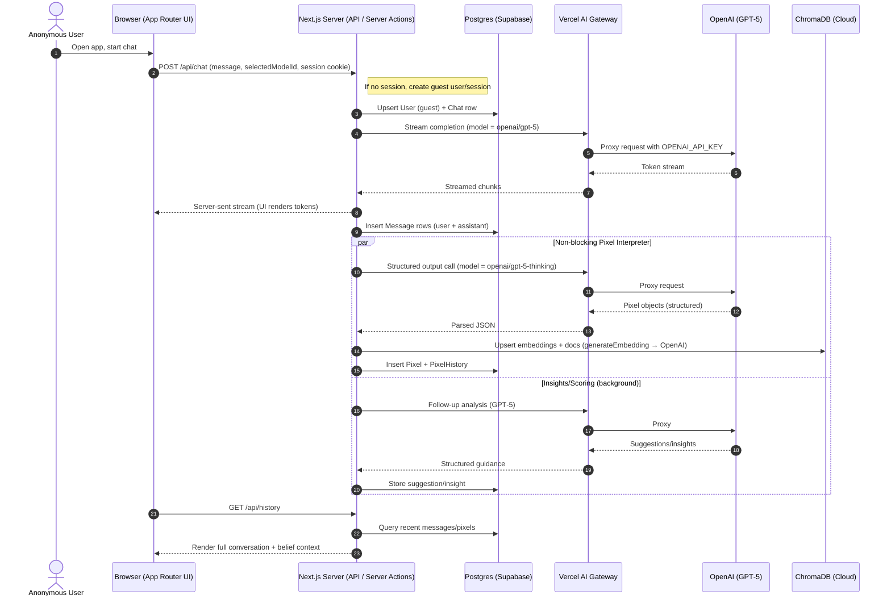

## Anonymous Message → Data Flow (High-Level)

This document describes the data flow when an anonymous user starts a new chat and sends their first message.

### Mermaid Diagram

### Key Notes

- Anonymous sessions use a guest account; credentials are not required.
- Primary chat model: `openai/gpt-5`. Reasoning path uses `openai/gpt-5-thinking`.
- Embeddings use OpenAI embeddings and are written to ChromaDB for RAG.
- Database holds durable state: `User`, `Chat`, `Message`, `Pixel`, `PixelHistory`.
- Vector store (ChromaDB) enables retrieval of relevant beliefs in later turns.
- All LLM calls route via Vercel AI Gateway using your `OPENAI_API_KEY`.
